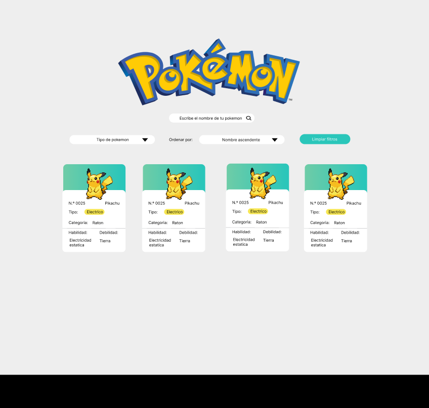

# Data Lovers

## 1. Resumen del proyecto

En este proyecto construimos una pagina web para visualizar una lista con los 251 Pokémon de la región de Kanto y Johto, junto con sus respectivas estadísticas usadas en el juego las cuales se adecuan a las necesidades de nuestros usuarios pokemon.

Como entregable final tenemos una pagina web que permite visualizar los pokemones, filtrarlos, ordenarlos y calcular cual es el pokemon mas fuerte y el mas debil

Hemos elegido específicamente este tema porque creemos que se adecúan bien a nuestros gustos y asi cumplir con los criterios de aprendizaje
construimos las historias de usuario a partir de nuestros conocimientos sobre el juego asi como tambien las interfaces centradas en el usuario final

#### Historias de usuario

Se crearon varias historias de usuario basadas en las siguientes preguntas de guia 

Aqui se muestra el resultado de las historias de usuario

#### Diseño de alta fidelidad y baja fidelidad
Para el proceso de este proyecto se realizaron varios prototipos de diseño de alta y baja fidelidad el cual nos permitieron establecer el diseño final para empezar a programarlo.

Al crear el diseño de baja fidelidad creamos un menu de usuarios con la finalidad de que el usuario eligiera si es experto o principiante

Durante este proceso nos dimos cuenta que apegarnos al diseño de baja fidelidad no cumplia con los criterios requeridos para el proyecto entonces creamos el diseño de alta fidelidad.

Una ves creado este diseño lo construimos en html y css

## 2. Funcionalidades

Como entregable final tenemos nuestro diseño de alta fidelidad implementada en la pagina web la cual visualiza las caracteristicas en forma de tarjeta de todos los pokemon encontrados.

A continuacion se define las funcionalidades que tiene nuestra pagina:

* La pagina permite ver las caracteristicas de los diferentes pokemon por medio de tarjetas, resaltando los valores de sus propiedades como el nombre, el numero, tipo, generacion, region, habilidades, debilidades y su imagen de cada uno.

  

* La interfaz esta estructurada con el uso de estandares como son los microdatos, itemscope, itemprop, itemtype

* Se implemento un input el cual nos permite buscar los pokemon por medio de nombre o numero sin importar si esta escrito en mayusculas o minusculas, tambien se valida que el pokemon exista y si no existe muestra un alert.

Ejemplo de busqueda por nombre

Ejemplo de busqueda por numero

Ejemplo de nombre no valido

En la pagina se implementaron varios botones los cuales nos permiten navegar entre las tarjetas de cierta forma:

* Filtrando por tipo: en esta funcion nos muestra las tarjetas de los pokemon segun su tipo, como en la siguiente imagen

* Calcular: nos muestra el pokemon mas fuerte o el mas debil, analizando la propiedad de estado de ataque de cada pokemon mostrando el numero mas alto o el mas bajo, este boton tambien puede analizar los pokemon por 'tipo' dependiendo del filtro aplicado en los select.

Ejemplo de la visualizacion del mas poderoso dependiendo del filtro

Ejemplo de la visualizacion del mas debil

* Ordenar datos: la pagina permite ordenar los datos sobre los datos con filtro de 'tipo', de acuerdo a el valor seleccionado en el select entre las opciones esta ordenar de forma ascendete (a-z) y ordenar de forma descendente (z-a) segun su nombre.

Ejemplo de orden de datos sin poner algun filtro

Ejemplo de orden de datos con filtro

* Conteo de pokemon: por ultimo se agrego la funcion de hacer un conteo de todos los pokemon con o sin filtro este aparecera de forma automatica en la parte de arriba de nuestras tarjetas. 

Ejemplo de conteo de todos los pokemon sin usar filtro

Ejemplo de conteo de todos los pokemon con filtro por tipo

* Limpiar filtros: se coloco un boton que limpia los filtros y mostrara de nuevo la pagina de inicio con los filtros reiniciados.

## 3. Consideraciones generales
* Este proyecto se resolvio en parejas.
* El proyecto será entregado en github
  [GitHub](url ) (commit/push) y la interfaz será desplegada
  usando [GitHub Pages](url ).
* La aplicación es responsiva,se visualiza sin problemas desde distintos tamaños de pantallas: móviles, tablets y desktops.

Ejemplo de como se muestra de forma responsiva

## 4. Consideraciones técnicas

La lógica del proyecto esta implementada completamente en JavaScript (ES6), HTML y CSS. En este proyecto no se utilizaron librerias ni frameworks, solo vainilla.

El boilerplate contiene una estructura de archivos como el siguiente ejemplo:
.
├── EXTRA.md
├── README.md
├── package.json
├── src
|  ├── data
|  |  ├── lol
|  |  |  ├── lol.js
|  |  |  ├── lol.json
|  |  |  └── README.md
|  |  ├── pokemon
|  |  |  ├── pokemon.js
|  |  |  ├── pokemon.json
|  |  |  └── README.md
|  |  └── // otras carpetas de data
|  ├── dataFunctions.js
   ├── view.js
|  ├── index.html
|  ├── main.js
|  └── style.css
└── test
   └── data.js
   └── data.spec.js
└── tests-read-only

### `src/index.html`

Existe un archivo `index.html` aqui va la página que se mostrará a la usuaria. También nos sirve para indicar
qué scripts se usarán y unir todo lo que hemos hecho.

### `src/main.js`

Se uso `src/main.js` para la interaccion con el DOM y mostrara los datos en pantalla, aqui se crearon nodos y manejadores de eventos

### `src/dataFunctions.js`

En este proyecto se desarrollaron todas la funcionalidades con las que se manipularon todos los datos correspondientes a los pokemon es decir obtener, procesar.

### `test/dataFunctions.spec.js`

En este archivo desarrollamos distintas pruebas unitarias de las funciones

### `test/data.js`

En esta archivo pusimos un extracto de los datos pokemon para poderlos usar en las pruebas unitarias y se exporto para poderlo usar desde otro archivo test/dataFunctions.spec.js

### `src/view.js`

Para tener un mejor orden se creo un archivo para poder crear las tarjetas de forma automatica y se exporto para poderlas renderizar en el html usando el archivo main.

## 6. Criterios de aceptación mínimos del proyecto

### Criterios de código

Se evaluo que el código cumpla con todos los criterios de aceptacion, probando cada test 

npm run test:oas-html

npm run test:oas-css

npm run test:oas-web-api

npm run test:oas-js

npm run test:oas

#### 5. Tecnologias usadas
En este proyecto se utizo lo siguiente:

#### HTML

* **Uso de HTML semántico**

  - [ ] Tiene un `<header>` con `<h1>`
  - [ ] Tiene un `<footer>`
  - [ ] Tiene un `<main>` con `<h2>`
  - [ ] Todas las etiquetas de controles (inputs, selects, radio, etc) tienen `<label>`
  - [ ] `<ul>` esta usado para dibujar la data
  - [ ] Los hijos de `<li>` usan attributos de microdata `itemscope` e `itemprop`

#### CSS

* **Uso de selectores de CSS**

  - [ ] Uso de selector class para los items `<li>`
  - [ ] Uso de flexbox en sentido `row` y `column`
  - [ ] Uso de flexbox para el elemento que contiene los items
  - [ ] Uso de flexbox para el elemento que contiene los UI inputs

#### Web APIs

* **Uso de selectores del DOM**

  - [ ] La aplicación usa [`querySelector`] para buscar los elementos del DOM
  
* **Manejo de eventos del DOM (listeners, propagación, delegación)**

  - [ ] `addEventListener` con callback que tiene parámetro de `event`, lo que permite el uso del objeto [`event`] 
  - [ ] La aplicación usa [Event Listeners]  para escuchar `click`, `change`, `keyup` dependiendo del evento que
    se quiere escuchar

* **Manipulación dinámica del DOM**

  - [ ] La aplicación actualiza el atributo [`innerHTML`] para limpiar los filtros y cargar las tarjetas pokemon.
  - [ ] La aplicación usa `createElement` y `appendChild`, o template strings para crear elementos en el css

#### JavaScript

* **Variables (declaración, asignación, ámbito)**

  - [ ] La aplicación declara variables con [`let`] y [`const`] de manera adecuada

* **Uso de condicionales (if-else, switch, operador ternario, lógica booleana)**

  - [ ] La aplicación usa el statement [`if..else`] para evaluar condiciones de acuerdo que datos utilizar

* **Uso de bucles/ciclos (while, for, for..of)**

  - [ ] La aplicación usa el statement [`for`] o método [`forEach`] para iterar sobre un array de elementos

* **Funciones (params, args, return)**

  En el archivo `dataFunctions.js` define las siguientes funciones:
  - [ ] una función `sortBy` que tiene 3 parámetros (`data`, `sortBy`, `sortOrder`)
    y devuelve el arreglo ordenado
  - [ ] una función `filterBy` que tiene 3 parámetros (`data`, `filterBy`, `value`)
    y devuelve el arreglo filtrado
  - [ ] una función `computeStats` que tiene al menos un parámetro (`data`)
    y devuelve un valor computado

* **Arrays (arreglos)**

  - [ ] Uso de [Arreglos]
  - [ ] Uso de [Array.prototype.sort()]
  - [ ] Uso de [Array.prototype.forEach()]
  - [ ] Uso de [Array.prototype.map()]
  - [ ] Uso de [Array.prototype.filter()]
  - [ ] Uso de [Array.prototype.reduce()]

* **Objetos**

  - [ ] Uso de notación de punto para [acceder propiedades] como lo son nombre, tipo, generacion y de mas caracteristicas de los pokemon
  - [ ] Uso de notación de brackets para [acceder propiedades] dependiendo de que posicion en el array queriamos acceder

* **Módulos de ECMAScript (ES Modules)**

  - [ ] La aplicación usa [`import`] y [`export`] para importar y exportar valores desde un modulo JavaScript.
  
